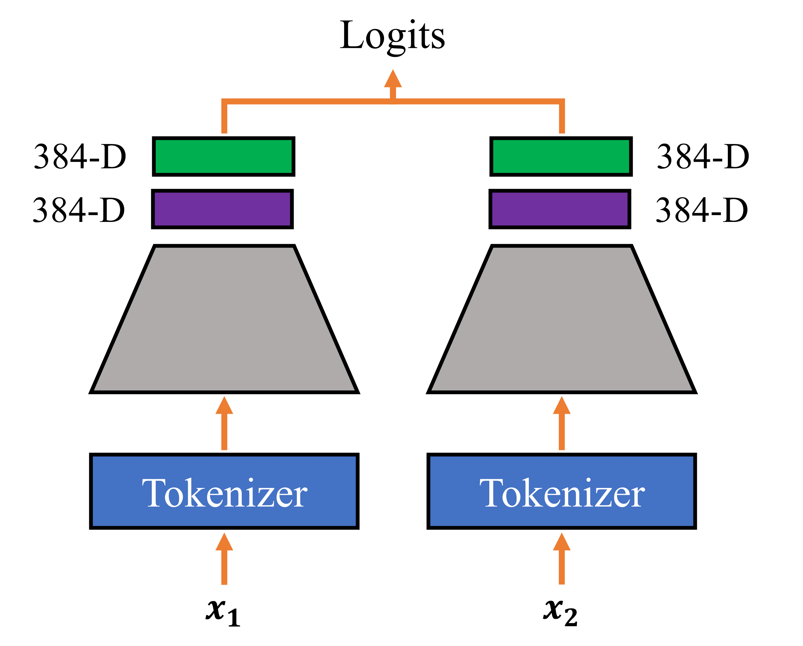

# Pretrained Training
The structure of this folder mimics that of [contrastive](../contrastive). Here, however, supervised learning is performed to train a linear layer to determine if a pair of sentence constitutes a paraphrase (label=1) or not (label=0).
In order to perform training, simply provide the name of the contrastive model under the encoder flag and select 'pretrained' as mode:
```
python main.py --mode=pretrained --config=Pretrained_Pairwise --encoder=Pairwise_RMS
```
The weights of the encoder will be frozen and only the linear layer trained on top.


## Files
| File                | Description                                             |
|---------------------|---------------------------------------------------------|
| learning_manager.py | Learning Manager class to define the training process   |
| predictor.py        | Perform inference on a dataset of sentence pairs       |
| model\_configs.py   | Script to write the model\_configs.json                 |
| models.py           | Model definition and optimizer selection                |


# Model Card
Note: The weights are not released publicly, please contact us with your desired use case via ss56pupo(at)studserv.uni-leipzig.de.

The models are Siamese models with two identical [sentence-transformers](https://www.SBERT.net) 
based on the encoder [all-MiniLM-L6-v2](https://huggingface.co/sentence-transformers/all-MiniLM-L6-v2/blob/main/README.md).
The underlying encoder was trained with a contrastive objective (see [contrastive](../contrastive)) that maps sentence pairs to two separate 384-dimensional embeddings.
The models in this directory have an additional linear layer on top of those embeddings to calculate new vector representations.
The logits are calculated as the dot product of those vector representations.

<p align="center">

</p>

## Usage
In order to use the model, install all necessary packages featured in [requirements.txt](../requirements.txt):
```
pip install -r requirements.txt
```
To apply the model, use the Predictor class provided in [predictor.py](./predictor.py).
You need to provide two inputs:
- A [Hugging Face dataset](https://huggingface.co/docs/datasets/index) "idx", "sentence1", "sentence2", and "labels" (e.g. [GLUE MRPC](https://huggingface.co/datasets/glue))
- A valid model name; Refer to [model_configs.json](./models/model_configs.json) for the available models

```
python
import predictor as p
from datasets import load_dataset

dataset = load_dataset(path="glue", name="mrpc")["validation"]

Predictor = p.Predictor(model_name=model_name)
Predictor.tokenize_dataset(dataset)
logits, labels = Predictor.predict(return_logits=True, batch_size=batch_size)
```

## Evaluation Results
The F1-scores, precision and recall values for each model can be found in the [evaluation](../evaluation) folder.
The columns relate to the follow datasets which are available on request via [HuggingFace](https://huggingface.co/ContrastivePretrainingProject):
- Val = [Custom validation dataset](https://huggingface.co/datasets/ContrastivePretrainingProject/contrastive_paraphrases)
- Test = [Custom test dataset](https://huggingface.co/datasets/ContrastivePretrainingProject/contrastive_paraphrases)
- noObf = [No obfuscation subset of PAN-13](https://huggingface.co/datasets/ContrastivePretrainingProject/pan_evaluation)
- randomObf = [Random obfuscation subset of PAN-13](https://huggingface.co/datasets/ContrastivePretrainingProject/pan_evaluation)
- translationObf = [Translation obfuscation subset of PAN-13](https://huggingface.co/datasets/ContrastivePretrainingProject/pan_evaluation)

## Background
The models were developed as part of a student research project to compare the performance of contrastive learning on text alignment with that of traditional supervised learning.

## Intended uses
The models are intended to be used for paraphrase detection, for instance in the text alignment subtask of text reuse identification.
By default, input text longer than 256 word pieces is truncated.

## Training procedure
The models were trained on a [custom dataset](https://huggingface.co/datasets/ContrastivePretrainingProject/contrastive_paraphrases) derived from [ParaBank](https://nlp.jhu.edu/parabank/) and [PAWS](https://arxiv.org/abs/1904.01130v1).
All models were trained for a maximum of ten epochs (shorter training occured when validation performance did not improve).
The name of each model reflects the loss function used to train the underlying encoder. All models were training using SGD.
- Pretrained_Pairwise: Loss function of encoder = Pairwise loss

### Hyperparameters
The values used in training are summarized in [model_configs.json](./models/model_configs.json).